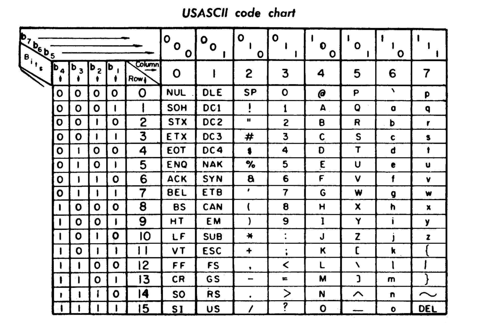
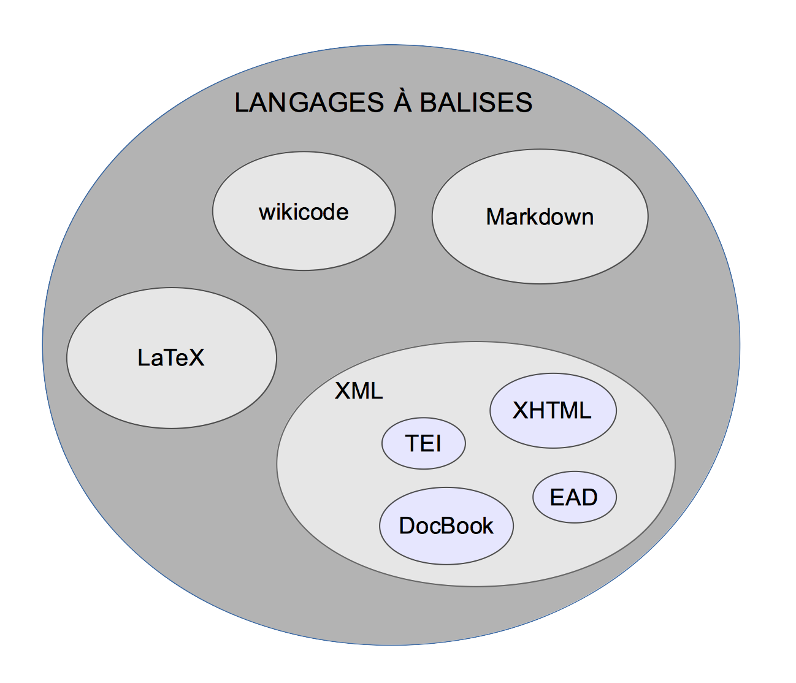

Du texte brut aux balises
===

# Texte brut / texte enrichi
* [Text brut (*plain text*)](https://fr.wikipedia.org/wiki/Texte_brut) = une chaîne de caractères : “bonjour” / “Bonjour” / “BONJOUR”
* Texte enrichi (*fancy text*) = le texte de nos traitements de textes  
Texte + mise en forme (à l’affichage) :
  * Bonjour / bonjour / bonjour / Bonjour / bonjour

Le **standard Unicode** définit le texte brut.

Le texte brut représente **le contenu basique, échangeable et interopérable du texte**.

Le texte brut représente **seulement les caractères contenus, sans leur apparence** (ceci signifie que seule une numérotation des caractère est utilisée, la police de caractères étant fournie par un mécanisme indépendant).

# Texte brut. Codage des caractères
* [ASCII](https://fr.wikipedia.org/wiki/American_Standard_Code_for_Information_Interchange) (*American Standard Code for Information Interchange*)  
Les caractères latins non accentués (écrire en anglais)  
codés sur 7 bits. 2<sup>7</sup> = [128 possibilités](https://fr.wikipedia.org/wiki/American_Standard_Code_for_Information_Interchange#Table_des_128_caract.C3.A8res_ASCII).
* [ISO 8859-1 (Latin 1)](https://fr.wikipedia.org/wiki/ISO/CEI_8859-1)  
Les 191 caractères de l’alphabet latin ; conçu comme une extension de l’ASCII  
codés sur 1 octet (8 bits). 28 = [? possibilités](https://fr.wikipedia.org/wiki/ISO/CEI_8859-1#ISO.2FCEI_8859-1_par_rapport_.C3.A0_ISO-8859-1).
* [UTF-8](https://fr.wikipedia.org/wiki/UTF-8) (Universal Character Set Transformation Format - 8 bits)  
L’ensemble des caractères du « répertoire universel de caractères codés »  
codés sur 1 à 4 octets (compatible Unicode et ASCII)  
L’UTF-8 est utilisé par 86 % des sites web en 2016.

# Table ASCII dans un manuel d’imprimante de 1972
(source [Wikipedia](https://fr.wikipedia.org/wiki/American_Standard_Code_for_Information_Interchange#/media/File:USASCII_code_chart.png)).



# Manipuler le texte brut – les regex

|regex|trouve|jargon|
|-----|------|------|
|`dans`|toutes les occurrences de “dans”||
|`^dans`|“dans” en début de ligne|ancre|
|`qui$`|“qui” en fin de ligne|ancre|
|`^$`|?||
|<code>de&#124;du</code>|toutes les occurrences de “de” et de “du”||
|`d[eu]`|toutes les occurrences de “de” et de “du”|classe de caractères|
|`[a-z]`|“a”, ou “b”, ou “c”, ..., ou “y”, ou “z”|intervalle (dans une classe)|
|`[^a-z]`|n’importe quel caractère sauf “a”, ou “b”, ou “c”, ..., ou “z”|classe complémentée (tout caractère qui n’est pas énuméré)|
|`s?`|zéro ou une occurrence de “s”|quantificateur, facultatif|
|`[a-z]*`|une ou plusieurs occurrences de la classe [a-z]|quantificateur, facultatif|
|`e+`|une ou plusieurs occurrences de “e”|quantificateur, obligatoire|
|`[a-z]{n}`|*n* occurrences de la classe `[a-z]`|quantificateur, obligatoire restrictif|
|`[a-z]{n,m}`|*n* à maximum *m* occurrences de la classe `[a-z]`|quantificateur, obligatoire restrictif|
|`[a-z]{n,}`|au moins *n* occurrences de la classe `[a-z]`|quantificateur, obligatoire non restrictif|
|`()`||capture de sous chaînes|

```txt
Le Poète assassiné
I
Renommée
La gloire de Croniamantal est aujourd'hui uni-
verselle. Cent vingt-trois villes dans sept pays sur
quatre continents se disputent l'honneur d'avoir vu
naître ce héros insigne. J'essayerai plus loin d'élu-
cider cette importante question.
Tous ces peuples ont plus ou moins modifié le
nom sonore de Croniamantal. Les Arabes, les Turcs
et autres peuples qui lisent de droite à gauche
n'ont pas manqué de le prononcer Latnamaïnorc,
mais les Turcs l'appellent bizarrement Pata, ce qui
signifie oie ou organe viril, à volonté. Les Russes
le surnomment Viperdoc, c'est-à-dire né d'un pet ;
on verra plus loin la raison de ce sobriquet. Les
Scandinaves, ou du moins les Dalécarliens, l'ap-
pellent volontiers quoniam, en latin, qui signifie
parce que, mais désigne souvent les parties nobles
dans les récits populaires du moyen âge. On voit
que les Saxons et les Turcs manifestent à l'égard
de Croniamantal le même sentiment en lui appli-
quant des surnoms identiques, mais dont l'origine
est encore mal expliquée. On suppose que c'est une
allusion euphémique à ce qui se trouvait dans le
rapport médical du médecin marseillais Ratiboul
sur la mort de Croniamantal. D'après cette pièce
officielle, tous les organes de Croniamantal étaient
sains et le médecin légiste ajoutait en latin, comme
fit l'aide-major Henry pour Napoléon : partes viriles
exiguitatis insignis, sicut pueri.
Au demeurant, il est des pays où la notion de
la virilité croniamantalesque a complètement dis-
paru. C'est ainsi qu'en Moriane les nègres le
nomment Tsatsa ou Dzadza ou Rsoussour, noms
féminins, car ils ont féminisé Croniamantal comme
les Byzantins ont féminisé le vendredi saint en en
faisant sainte Parascève.
II
Procréation
A deux lieues de Spa, sur la route bordée
d'arbres tordus et de buissons, Viersélin Tigoboth,
musicien ambulant qui arrivait à pied de Liége,
battait le briquet pour allumer sa pipe. Une voix
de femme cria :
« Eh ! monsieur ! »
Il leva la tête et un rire éperdu éclata :
« Hahaha ! Hohoho ! Hihihi ! tes paupières ont
la couleur des lentilles d'Egypte ! Je m'appelle
Macarée. Je veux un matou. »
Viersélin Tigoboth aperçut sur le bord de la
route une jeune femme brune, formée de jolis
globes. Qu'elle était gracieuse en jupe courte de
cycliste ! Et tenant d'une main son vélo, tandis
```

# <span style="color:orange">Exercice – manipuler du texte brut</span>
> * convertir apollinaire1.txt en UTF-8 ;
* restructurer apollinaire1.txt en paragraphes (utiliser les regex ?) ;
* cette structuration en paragraphe est-elle explicite ?
* le texte reste-t-il le même ?
* trouver une manière de caractériser (dans le fichier) les éléments éditoriaux :
  * le titre principal
  * les titres hiérarchiques
  * les paragraphes
  * la pagination
  * la mise en valeur typographique (comment désambiguïser la sémantique de l’italique ?)
  * ?

> De quoi avons-nous besoin ?


# Langages à balises (*Markup Languages*)
```
                     $$contenu divers$$
               <balise>contenu divers</balise>
```

* Texte brut : « qui signifie parce que »
* Résultat attendu : « qui signifie *parce que* »
* Balises :
  * qui signifie `<i>parce que</i>` (HTML5)
  * qui signifie `` *parce que* `` (Markdown)

# Des balises

|langage|balise|
|---|---|
|[Markdown](http://spec.commonmark.org/0.28/#emphasis-and-strong-emphasis)|`balisage *ad hoc* pour l’italique.`|
|[wikicode](https://fr.wikipedia.org/wiki/Aide:Syntaxe#Forme_du_texte)|`balisage ''ad hoc'' pour l’italique.`|
|[LaTeX](http://www.tuteurs.ens.fr/logiciels/latex/manuel.html#s3_6)|`balisage \emph{ad hoc} pour l’italique.`|
|[DocBook](http://tdg.docbook.org/tdg/4.5/emphasis.html)|`balisage <emphasis>ad hoc</emphasis> pour l’italique.`|
|[HTML5](https://www.w3.org/TR/html5/text-level-semantics.html#the-i-element)|`balisage <i>ad hoc</i> pour l’italique.`|
|XML|`balisage <italique>ad hoc</italique> pour l’italique.`|
|XML|`?`|
|[TEI](http://www.tei-c.org/release/doc/tei-p5-doc/fr/html/ref-hi.html)|`balisage <hi rend="i">ad hoc</hi> pour l’italique.`|
|XML|`balisage <locutionEtrangere>ad hoc</locutionEtrangere> pour l’italique.`|

# Mise en valeur (typographique) *vs* sémantique

## 1/2. [Typographie](http://www.orthotypographie.fr/volume-II/langue_etrangere-lune.html)

|langage|balise|documentation|
|---|---|---|
|[Markdown](http://spec.commonmark.org/0.28/#emphasis-and-strong-emphasis)|`` *ad hoc* ``|"Markdown treats asterisks (*) and underscores (_) as indicators of emphasis."|
|[wikicode](https://fr.wikipedia.org/wiki/Aide:Syntaxe#Forme_du_texte)|`balisage ''ad hoc'' pour l’italique.`|"Il est possible de mettre le texte en gras, en italique, etc., pour mettre en valeur les informations d'un texte ou pour écrire le titre d'une œuvre selon les conventions (par exemple, un titre de film doit être en italique)."|
|[LaTeX](http://www.tuteurs.ens.fr/logiciels/latex/manuel.html#s3_6)|`\emph{ad hoc}`|"…pour mettre en valeur certains mots, les titres d'ouvrages en particulier."|
|[HTML5](https://www.w3.org/TR/html5/text-level-semantics.html#the-i-element)|`balisage <i>ad hoc</i> pour l’italique.`|"The `i` element represents a span of text in an alternate voice or mood, or otherwise offset from the normal prose in a manner indicating a different quality of text, such as a taxonomic designation, a technical term, an idiomatic phrase from another language, transliteration, a thought, or a ship name in Western texts."|
|[TEI](http://www.tei-c.org/release/doc/tei-p5-doc/fr/html/ref-hi.html)|`balisage <hi rend="i">ad hoc</hi> pour l’italique.`|"`<hi>` distingue un mot ou une expression comme graphiquement distincte du texte environnant, sans en donner la raison."|

## 2/2. Balisage sémantique

<!-- échappement de | in table est une catastrophe: https://stackoverflow.com/questions/17319940/how-to-escape-a-pipe-char-in-a-code-statement-in-a-markdown-table/17320389#17320389 -->
|langage|balise|documentation|
|---|---|---|
|[wikicode](https://fr.wikipedia.org/wiki/Mod%C3%A8le:Langue)|<code>{{Langue&#124;code de langue&#124;texte}}</code>|"Ce modèle a pour but d’indiquer la langue d’un texte, notamment pour les synthétiseurs vocaux et l’indexation…"|
|[LaTeX](http://www.tuteurs.ens.fr/logiciels/latex/manuel.html#s1_3)|`\selectlanguage{latin}{ad hoc}`|"Pour alterner entre les langues, on utilise la commande (…) en spécifiant entre accolades la langue demandée."|
|[HTML5](https://www.w3.org/TR/html5/dom.html#the-lang-and-xml:lang-attributes)|`<i lang="la">ad hoc</i>`|"The `lang` attribute (in no namespace) specifies the primary language for the element's contents and for any of the element's attributes that contain text."|
|[TEI](http://www.tei-c.org/release/doc/tei-p5-doc/fr/html/ref-foreign.html)|`balisage <foreign xml:lang="la">ad hoc</foreign>`|"`<foreign>` reconnaît un mot ou une expression comme appartenant à une langue différente de celle du contexte."|

# XML et les autres



# <span style="color:orange">Exercice – Balises et modèles éditoriaux</span>
>Comparer les fichiers balisés (sémantique et modèle documentaire) :
  * Markdown : apollinaire.md
  * LaTeX : apollinaire.tex
  * DocBook : apollinaire_db.xml
  * HTML5 : apollinaire.html
  * XML/TEI : apollinaire_tei.xml

> Regrouper les fichiers par "famille" de balises.  
Structuration visuelle ou sémantique ?  
Quel usage (comment lire les fichiers) ?  
Des équivalences entre balises ?  
Forces et faiblesses de chaque balisage ?
